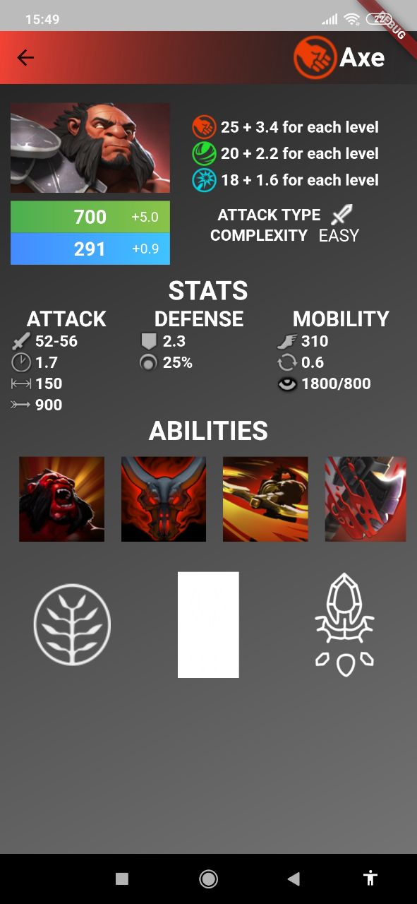
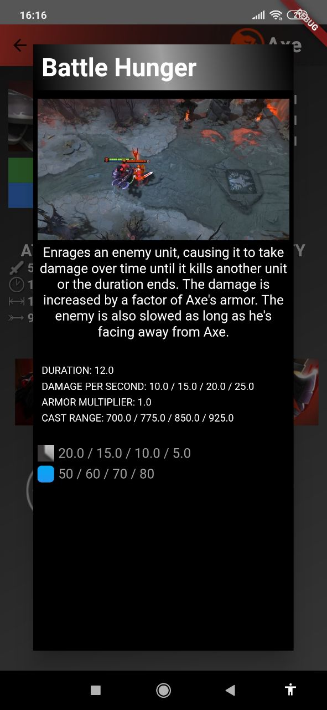
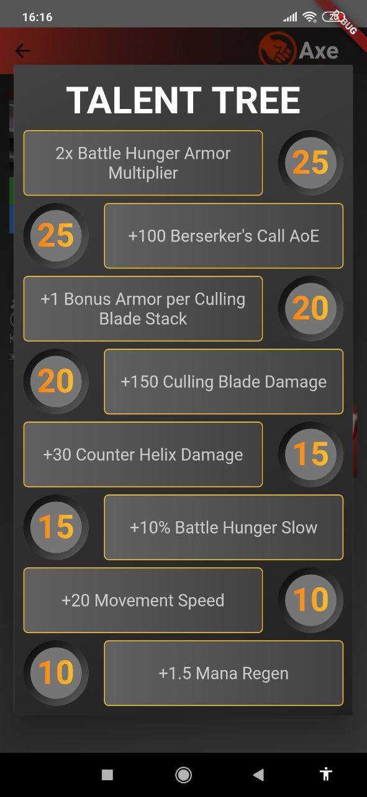

# Introduction 
Percapita application

### Preview

  
Some screenshots

    

      
      
      
      
      
    

### Architecture

* [Kotlin](https://kotlinlang.org/) 100%,
* [Compose](https://developer.android.com/jetpack/compose/)
* [Coroutines](https://github.com/Kotlin/kotlinx.coroutines),
* [Flow](https://kotlinlang.org/docs/flow.html),

* Presentation layer pattern - MVI

### Libraries
* DI
  * [Hilt Android](https://developer.android.com/training/dependency-injection/hilt-android)
  * [Hilt Compiler](https://developer.android.com/training/dependency-injection/hilt-android)

* Internet & Parsing
  * [OKHttp](https://square.github.io/okhttp/)
  * [Gson](https://github.com/google/gson)
  * [Retrofit](https://square.github.io/retrofit/)

* Room
  * [Runtime](https://developer.android.com/training/data-storage/room)
  * [Compiler](https://developer.android.com/training/data-storage/room)
  * [Kotlin Extensions and Coroutines support](https://developer.android.com/training/data-storage/room)

* Other
  * [Material Components For Android](https://mvnrepository.com/artifact/com.google.android.material/material)
  * [Room](https://developer.android.com/jetpack/androidx/releases/room)
  * [LiveData](https://developer.android.com/topic/libraries/architecture/livedata)
  * [ViewModel](https://developer.android.com/topic/libraries/architecture/viewmodel)
  * [Timber](https://mvnrepository.com/artifact/com.jakewharton.timber/timber)
  * [Dokka](https://github.com/Kotlin/dokka)
  * [Kotlinx DateTime](https://github.com/Kotlin/kotlinx-datetime)
  * [Core Kotlin Extensions](https://developer.android.com/kotlin/ktx#core)

* Test
  * [JUnit](https://mvnrepository.com/artifact/junit/junit)
  * [Test Core KTX Extensions](https://developer.android.com/jetpack/androidx/releases/test#core_141_2)
  * [Test JUnit KTX Extensions](https://developer.android.com/jetpack/androidx/releases/test#junit_extensions_114_2)
